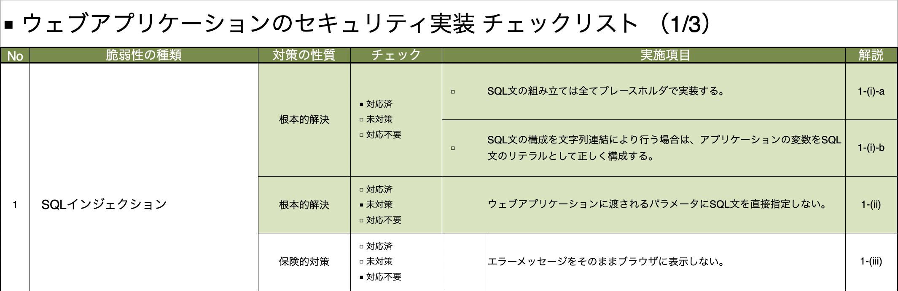

# security_implementation_checklist_generator
セキュリティ実装チェックリストジェネレータ

## 使い方
- 質問の回答番号を入力する
```
SQL文の組み立ては全てプレースホルダで実装する。
1  対応済
2  未対策
3  対応不要
Answer: 1
ウェブアプリケーションに渡されるパラメータにSQL文を直接指定しない。
1  対応済
2  未対策
3  対応不要
Answer: 2
エラーメッセージをそのままブラウザに表示しない。
1  対応済
2  未対策
3  対応不要
Answer: 3
```

- 不正な値を入力した場合はエラーが出力される
```
ウェブアプリケーションに渡されるパラメータにSQL文を直接指定しない。
1  対応済
2  未対策
3  対応不要
Answer: 4
Error: 値が不正です
Answer: hoge
Error: 値が不正です
Answer: 
```

- `Output Completed.` が表示されたら`output.xlsx`が出力される

